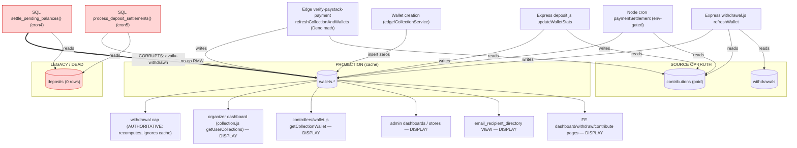

# FINANCIAL_DEPENDENCY_GRAPH (master)

Read-only synthesis of writers (`WALLET_WRITE_MATRIX.md`), readers (`WALLET_READ_MATRIX.md`), and the `deposits`/settlement subsystem. Grounded in code + live DB introspection.

## Edge legend
- **Bold red (`==>`):** `settle_pending_balances()` — the only edge that corrupts. Reads empty `deposits`, overwrites `wallets.available/pending` nightly.
- **`deposits` (red):** empty, unreferenced by any view/trigger/FK; only the two SQL functions and the dormant Express init path read/write it.
- **Every correct wallet value** flows from `contributions` (+`withdrawals`) via a Node or Deno writer.
- **The withdrawal cap** is the only money-critical *reader*, and it **recomputes** rather than trusting the cache → corruption cannot cause an over-payout.

## What to cut (Phase 2.1B)
Sever the two red edges (`settle_pending_balances`, `process_deposit_settlements`) → corruption stops, **no other edge is touched**. Then recompute `wallets` from `contributions` (any canonical writer) → all DISPLAY readers correct instantly. See `EXECUTION_ORDER.md`.

## One-line dependency truth
> `wallets` depends entirely on `contributions`+`withdrawals`. `deposits` depends on nothing and nothing depends on it. The corruptor depends on `deposits`. Therefore removing the corruptor and the `deposits` subsystem is safe.
