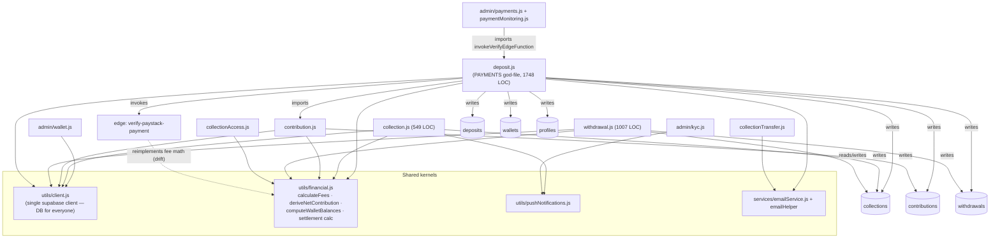

# Kolekto — Business-Domain Dependency Graph (Wave 0.4)

**Purpose:** map how domains actually depend on each other *today* (grounded in imports + table writes), rank the coupling hotspots, and define the *allowed* dependency edges the Phase 1 service layer must converge to. This is the reference the Collection consolidation (Wave 1) and every later wave is measured against.

**Grounding method:** cross-domain `import` edges and every `.from("<table>")` write in `kolekto-be-old/controllers/**` were enumerated (see audit §2). Table and symbol names below are the real ones in the code.

> Correction vs first audit pass: the settlement/transaction table in code is **`deposits`** (not `transactions`), and a separate **`wallets`** table exists *alongside* balance columns on `collections`. Fee math is already centralized in **`utils/financial.js`** — the Edge `create-collection` has an *inline reimplementation* of it, and that copy is the true duplicate.

---

## 1. Current dependency graph (as-is, tangled)



**What the graph says:**
- **`deposit.js` is the coupling black hole.** It writes to `deposits`, `collections`, `contributions`, `wallets`, `withdrawals`, `profiles` and imports `createContribution`. Payments has no boundary — it *is* six domains.
- **`utils/client.js` is a shared mutable DB handle** every controller writes through directly → there is no repository layer; ownership is unenforceable.
- **`utils/financial.js` is a healthy asset:** fee/settlement/wallet math is already pure and shared by `collection`, `contribution`, `withdrawal`, `collectionAccess`. It is the seed of `PricingService` + `WalletService`.
- **The real create-collection duplication** is the Edge function's *inline* fee logic drifting from `utils/financial.js` — not two independent fee engines. Consolidation = make the one authoritative path use `financial.js`, retire the edge copy.
- **`wallets` table + `collections` balance columns coexist** → two sources of balance truth (why admin needs live-recompute; memory `admin_wallet_live`).

---

## 2. Coupling hotspots (ranked, for refactor order)

| Rank | Hotspot | Evidence | Consequence | Addressed in |
|------|---------|----------|-------------|--------------|
| 1 | `deposit.js` writes 6 domains' tables | `.from()` on deposits/collections/contributions/wallets/withdrawals/profiles | No boundary; every money bug lands here | Wave 3 |
| 2 | No repository layer — `utils/client.js` written everywhere | every controller imports it | Ownership unenforceable; RLS is only guard | Waves 1–6 |
| 3 | Edge fee logic drifts from `utils/financial.js` | edge `create-collection`/`initiate-paystack-payment` reimplement | Create-collection rule divergence | Wave 1–2 |
| 4 | Two balance sources (`wallets` + `collections` cols) | deposit writes both; admin live-recompute | Stale balances | Wave 3 |
| 5 | Admin controllers depend on `deposit.js` internals (`invokeVerifyEdgeFunction`) | admin/payments imports it | Payments refactor breaks admin | Wave 3/5 |
| 6 | Contribution created from 3 runtimes | edge / express / client | No single "contribution exists" | Wave 2 |

---

## 3. Target domain dependency graph (to-be, allowed edges only)

Rule: a domain may depend on another domain **only via its Service**; nothing writes another domain's tables; `utils/financial.js` becomes `PricingService`/`WalletService` calc core; `utils/client.js` is used **only inside repositories**.

```mermaid
graph TD
  subgraph Controllers (thin)
    c1[collections ctrl]; c2[contributions ctrl]; c3[payments ctrl]; c4[withdrawals ctrl]; c5[admin ctrls]
  end

  CS[CollectionService]
  KS[ContributionService]
  PS[PaymentService]
  WS[WalletService]
  WDS[WithdrawalService]
  PR[PricingService<br/>(from utils/financial.js)]
  NS[NotificationService]
  KY[KycService]

  c1-->CS; c2-->KS; c3-->PS; c4-->WDS; c5-->CS; c5-->KY; c5-->PS

  CS-->PR
  CS-->NS
  KS-->PR
  PS-->KS
  PS-->WS
  PS-->NS
  WDS-->WS
  WS-->PR

  CS-->Rc[(CollectionRepo)]
  KS-->Rk[(ContributionRepo)]
  PS-->Rp[(PaymentRepo)]
  WS-->Rw[(WalletRepo)]
  WDS-->Rd[(WithdrawalRepo)]
  KY-->Rky[(KycRepo)]

  Rc-->DB[(Supabase via utils/client.js)]
  Rk-->DB; Rp-->DB; Rw-->DB; Rd-->DB; Rky-->DB
```

**Allowed service→service edges (the only cross-domain calls permitted):**

| From | May call | For |
|------|----------|-----|
| `PaymentService` | `ContributionService`, `WalletService`, `NotificationService` | mark contribution paid, credit wallet, receipt/push |
| `CollectionService` | `PricingService`, `NotificationService` | fee breakdown, status-change push |
| `ContributionService` | `PricingService` | fee/net calc |
| `WithdrawalService` | `WalletService` | cap = balance − pending |
| `WalletService` | `PricingService` | settlement/net math |
| admin controllers | `CollectionService`, `KycService`, `PaymentService` | status decisions, KYC decisions, reconcile |

Any edge **not** in this table is a violation. Notably: nothing may write `wallets`/`collections` balance except `WalletService`; nothing may write `contributions` except `ContributionService`/`PaymentService`.

---

## 4. Convergence order (why Collections is safe to do first)

`CollectionService` sits at a **leaf** of the target graph — it depends only on `PricingService` (already pure, `utils/financial.js`) and `NotificationService` (already isolated in `utils/pushNotifications.js`). It is **not** depended on by `deposit.js` for writes (deposit writes `collections` balance columns, which move to `WalletService` in Wave 3, not Wave 1). Therefore consolidating Collections:
- touches no other domain's service,
- reuses the already-centralized fee kernel,
- and lets us prove the Service→Repository pattern on the lowest-risk financial domain before touching Payments/Wallets.

This validates the user's sequencing: **finish and validate Collections before any other financial domain.**
