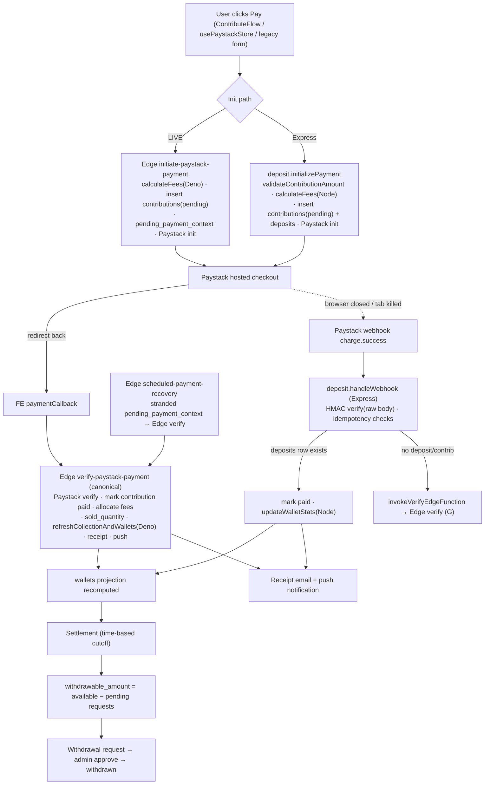
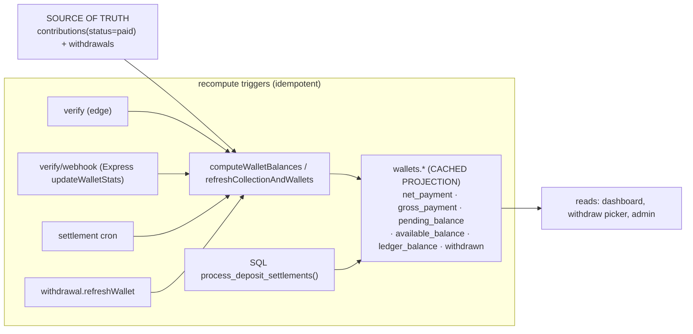
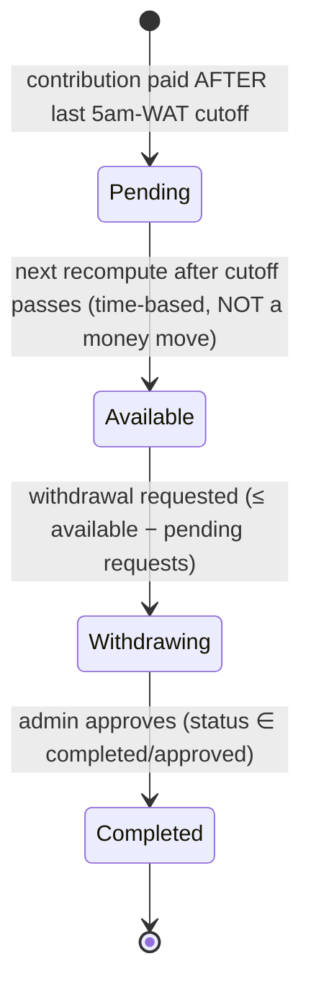
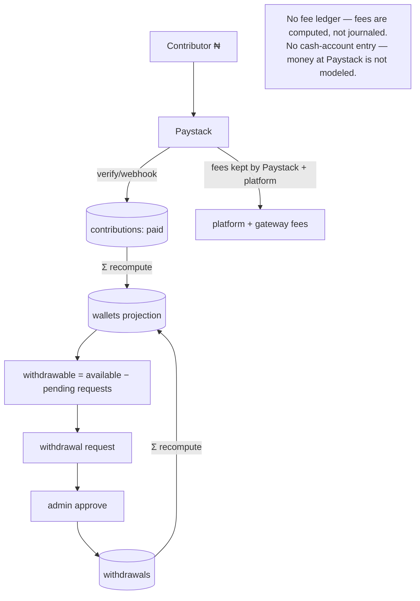

# KOLEKTO 4.0 — Phase 2 Financial Architecture Audit

**Prepared as:** Principal Software Architect / Senior Backend / Fintech Infrastructure Engineer.
**Scope:** the entire money path across `kolekto-be-old` (Express + crons), `kolekto-fe-old` Supabase Edge Functions, the Postgres layer, and the React clients.
**Mandate:** **discovery, documentation, and design ONLY.** No code changed. No Workspaces/Orgs/Ledger implemented. This is the financial-core companion to `KOLEKTO_PHASE1_ENGINEERING_AUDIT.md`; it applies the same discipline used for the Collection migration to the far higher-risk Payments/Wallet/Settlement domains.

**Grounding:** every file/line reference below was read directly. Key sources: `controllers/deposit.js` (1748 LOC), `controllers/withdrawal.js` (1007), `utils/financial.js`, `jobs/paymentSettlement.js`, edge `initiate-paystack-payment` / `verify-paystack-payment` (+ `_shared1.ts`/`_shared2.ts`) / `settle-pending-deposits` / `scheduled-payment-recovery`.

---

## 1. Financial Architecture Audit — Executive Summary

Kolekto's money core **works and is defensively engineered** (idempotent recompute, HMAC webhooks, strict-cap withdrawals, T+1 settlement, orphan recovery). But it is **spread across four runtimes with the same financial math reimplemented up to three times**, and its correctness rests on **re-summing source rows on every event** rather than a ledger. Concretely:

1. **The money model is single-entry + a cached projection.** The **source of truth is `contributions(status='paid')` and `withdrawals`.** `wallets.*` balance columns are a **derived projection**, recomputed from those rows by `computeWalletBalances`. This is good (rebuildable) — but there is **no immutable journal**: `contributions` rows are **mutated in place** on verify (`amount`, `gross_amount`, `status`, `contributor_unique_code` overwritten — [deposit.js:920](../kolekto-be-old/controllers/deposit.js#L920)), so history is destructible and there is no double-entry balance guarantee.

2. **The same balance math exists in THREE implementations that must be kept in sync by hand:**
   - Node — `utils/financial.js computeWalletBalances` ([financial.js:188](../kolekto-be-old/utils/financial.js#L188)), used by `deposit.updateWalletStats`, `withdrawal.refreshWallet`, and the settlement cron.
   - Deno — `verify-paystack-payment/_shared2.ts refreshCollectionAndWallets` ([_shared2.ts:40](supabase/functions/verify-paystack-payment/_shared2.ts#L40)) — a line-by-line reimplementation (same 5am-WAT cutoff) that **additionally** writes tier `sold_quantity`.
   - SQL — `process_deposit_settlements()` Postgres function, invoked by the `settle-pending-deposits` edge ([settle-pending-deposits/index.ts:32](supabase/functions/settle-pending-deposits/index.ts#L32)).

3. **Fee math exists in two runtimes** with hardcoded constants that can drift: Node `calculateFees` (constants `MAX_FEE_AMOUNT`, `GATEWAY_FEE_RATE`, `PLATFORM_FEE_RATES`) vs Deno `initiate-paystack-payment calculateFees` (hardcodes `min(x, 2000)` and `0.015`, [initiate…/index.ts:107](supabase/functions/initiate-paystack-payment/index.ts#L107)).

4. **Settlement exists in three mechanisms** (Node cron, SQL RPC, and implicit recompute-on-every-verify) that can disagree.

5. **A real financial race remains:** the withdrawal cap check is **read-then-insert with no lock or DB constraint** — two concurrent requests can each pass the cap and over-withdraw ([withdrawal.js:423](../kolekto-be-old/controllers/withdrawal.js#L423)).

6. **Idempotency is procedural, not structural:** duplicate protection relies on `payment_reference` lookups, not a **unique constraint** on `contributions.payment_reference` / `deposits.payment_reference`.

**Consequence for the Financial OS vision (Orgs, Workspaces, Org wallets, OPay/multi-provider):** every one of these must gain `workspace_id`, per-provider handling, and multi-member concurrency. With balance math triplicated, fees duplicated, and no ledger, each new invariant costs 3× and the concurrency/scale ceiling (full-table re-sum per payment) will bite. **The Phase 2 mandate — one authoritative implementation per financial operation, then a ledger — is the prerequisite for everything after it.**

**Headline recommendation:** consolidate to **Express-owned `PaymentService` / `ContributionService` / `WalletService` / `SettlementService` / `WithdrawalService`** over **one** fee module and **one** balance module; demote the Deno/SQL reimplementations to callers of the canonical path (or retire them); then introduce an **append-only double-entry `ledger_entries`** table with `wallets` as its projection. Backward-compatible, additive, staged — exactly like the Collection migration.

---

## 2. Payment Lifecycle Diagram



**Per-step ownership (file · function · runtime · rules · duplicates):**

| Step | File · function | Runtime | Business rules | Duplicate of |
|------|-----------------|---------|----------------|--------------|
| Pay (init, live) | [initiate-paystack-payment/index.ts](supabase/functions/initiate-paystack-payment/index.ts) | Edge | fee calc, tier/qty, unique-code intent, `pending_payment_context` | deposit.initializePayment |
| Pay (init, Express) | [deposit.js:359](../kolekto-be-old/controllers/deposit.js#L359) `initializePayment` | Express | server amount validation, re-derive `totalPayable`, insert `deposits`+`contributions` | initiate edge |
| Gateway | Paystack `/transaction/initialize` + `/verify` | external | — | — |
| Verify (canonical) | [verify-paystack-payment/index.ts](supabase/functions/verify-paystack-payment/index.ts) | Edge | mark paid, fee allocation, sold_quantity, wallet recompute, receipt, push | deposit.verifyPayment |
| Verify (Express) | [deposit.js:616](../kolekto-be-old/controllers/deposit.js#L616) `verifyPayment` | Express | deposit-path verify + Paystack fallback + `updateWalletStats` | edge verify |
| Webhook | [deposit.js:1254](../kolekto-be-old/controllers/deposit.js#L1254) `handleWebhook` | Express | HMAC, idempotency safety-nets, bridge to edge verify | — (bridges) |
| Wallet update | [deposit.js:242](../kolekto-be-old/controllers/deposit.js#L242) `updateWalletStats` / edge `refreshCollectionAndWallets` | Express + Edge | recompute projection from source rows | each other + SQL RPC |
| Settlement | [paymentSettlement.js](../kolekto-be-old/jobs/paymentSettlement.js) / `process_deposit_settlements()` / recompute-on-verify | Cron + SQL + Edge | roll pending→available by 5am cutoff | each other |
| Recovery | [scheduled-payment-recovery/index.ts](supabase/functions/scheduled-payment-recovery/index.ts) | Edge | re-verify stranded refs | — |
| Withdrawal | [withdrawal.js:272](../kolekto-be-old/controllers/withdrawal.js#L272) `requestWithdrawal` | Express | strict-cap, admin approve | — (single, good) |
| Receipts | edge `renderReceiptEmail` + backend `paymentConfirmation.js` | Edge + Express | premium receipt (two synced copies — memory `receipt_email`) | each other |
| Notifications | `notifyContributionByReference` / in-app notifications | Express | dedupe per reference | — |

---

## 3. Contribution Lifecycle Diagram

```mermaid
stateDiagram-v2
  [*] --> pending: insert on payment init (edge OR deposit.initializePayment OR client)
  pending --> paid: verify/webhook — amount+gross_amount+status MUTATED in place
  pending --> abandoned: never verified (no explicit state; row stays 'pending')
  paid --> paid: re-verify (idempotent recompute; row re-touched)
  paid --> [*]
  note right of paid
    On transition the row is OVERWRITTEN:
    amount = net, gross_amount = totalPayable,
    contributor_unique_code, payment_reference.
    No immutable history — this is the ledger-readiness gap.
  end note
```

**Contribution operations & owners:**

| Operation | Where | Runtime | Notes |
|-----------|-------|---------|-------|
| Create (pending, live) | edge initiate insert `contributions` | Edge | primary |
| Create (pending, Express) | [deposit.js:467](../kolekto-be-old/controllers/deposit.js#L467) | Express | new-format inline insert |
| Create (legacy) | [contribution.js](../kolekto-be-old/controllers/contribution.js) `createContribution` | Express | via `deposit.initializePayment` legacy branch |
| Create (client) | [useContributionStore.ts:72](src/store/useContributionStore.ts#L72) | React | direct insert — should be removed (Phase 1 §10) |
| Mark paid | verify edge + `deposit.verifyPayment` + `handleWebhook` | Edge + Express | **mutates row in place** (3 copies of the mutation) |
| Status update (client) | [useContributionStore.ts:123](src/store/useContributionStore.ts#L123) | React | direct status write — remove |
| Duplicate prevention | `payment_reference` lookups | Edge/Express | **no DB unique constraint** (procedural only) |
| Unique code | `resolveContributionUniqueCode` | Express/Edge | idempotent by design |
| Exports / reads | dashboard/admin | Express/React | read-side |

---

## 4. Wallet Lifecycle Diagram



**Balance definitions (canonical, from `computeWalletBalances`):**
- `net_payment` (Total Raised) = Σ paid `contribution.amount` (net of fees).
- `gross_payment` = Σ `gross_amount` (what contributors paid).
- `pending_balance` = Σ net for contributions with `created_at ≥ 5am-WAT cutoff`.
- `available_balance` = `max(0, (net − pending) − completedWithdrawals)`.
- `ledger_balance` = `available + pending`.
- `withdrawn` = Σ withdrawals in `{completed, successful, success, approved}`.

**Mutable balance fields:** all six `wallets.*` columns (cached, overwritten each recompute) + `collections.total_contributions` + `collections.price_tiers.sold_quantity/remaining_quantity` (edge only). **Derived truth** lives in `contributions`+`withdrawals`. **Inconsistency/tech-debt:** balances are stale between recomputes (admin added a live-recompute endpoint to work around this — memory `admin_wallet_live`); the edge path updates tier sold-counts but the Express path does not.

---

## 5. Settlement Lifecycle Diagram



**Key insight:** settlement is **not a money movement** — it is a **derived classification by timestamp**. `pending` vs `available` is purely `created_at < getSettlementCutoff()`. The cron/RPC just *recompute the projection* so pending rolls into available once the cutoff passes. **Transitions & risks:**

| Transition | Mechanism | Race / duplicate risk |
|------------|-----------|------------------------|
| paid → pending/available | `computeWalletBalances` filter by cutoff | **Three impls** (Node/Deno/SQL) must agree on the cutoff & formula |
| pending → available (daily) | Node cron **and** SQL RPC **and** every verify recompute | overlapping executors; multi-replica gated by `RUN_SETTLEMENT_CRON` |
| available → withdrawn | `requestWithdrawal` + admin approve | **read-then-insert cap check = TOCTOU over-withdrawal race** |
| boundary | contribution created exactly at cutoff | classification flips depending on which impl/clock runs |

---

## 6. Financial Write Inventory

Legend: **RX** React · **EX** Express · **ED** Edge · **CR** cron · **SQL** Postgres function/trigger.

| Table | Write | Where | Runtime |
|-------|-------|-------|---------|
| `contributions` | insert (pending) | edge initiate; deposit.initializePayment; contribution.createContribution; **client** useContributionStore | ED/EX/RX |
| `contributions` | update → paid (mutates amount/gross/code) | edge verify; deposit.verifyPayment; deposit.handleWebhook; **client** updateContributionStatus | ED/EX/RX |
| `deposits` | insert (pending) | deposit.initializePayment | EX |
| `deposits` | update (paid_at/status/flags) | deposit.verifyPayment; deposit.handleWebhook | EX |
| `wallets` | insert/upsert (on collection create) | edge create-collection; CollectionService (Phase 1) | ED/EX |
| `wallets` | update (6 balance cols) | deposit.updateWalletStats; edge refreshCollectionAndWallets; settlement cron; withdrawal.refreshWallet; **SQL** process_deposit_settlements | EX/ED/CR/SQL |
| `withdrawals` | insert (pending) | withdrawal.requestWithdrawal | EX |
| `withdrawals` | update (approve/reject) | withdrawal.approve/reject | EX |
| `collections` | update total_contributions / price_tiers sold | deposit.updateWalletStats; edge refreshCollectionAndWallets | EX/ED |
| `campaigns` / `*_documents` / `*_images` | insert (fundraising) | edge create-collection; CollectionService | ED/EX |
| `pending_payment_context` | insert / read | edge initiate; scheduled-recovery | ED |
| `payment_recovery_log` | insert | recovery paths (memory `orphaned_payment_recovery`) | EX/ED |
| `notifications` / `push_*` | insert | notify* helpers | EX |
| SETTLEMENT | recompute | `process_deposit_settlements()` | SQL |

**Every financial write path is now identified.** The high-risk multi-writer cells are `contributions.update→paid` (4 writers) and `wallets.update` (5 writers).

---

## 7. Duplicate Logic Report (with canonical owner)

| Rule | Implementations | Canonical owner (recommended) |
|------|-----------------|-------------------------------|
| **Fee calculation** | Node `calculateFees` ([financial.js:72](../kolekto-be-old/utils/financial.js#L72)); Deno `calculateFees` (initiate edge, hardcoded 2000/0.015); Deno fee allocation (verify edge) | **`PricingService`** (Node) — single fee module; edges call it or a shared config; delete Deno copies |
| **Net derivation** | `deriveNetContribution` (Node); verify-edge allocation | `PricingService.netOf()` |
| **Wallet/balance recompute** | `computeWalletBalances` (Node); `refreshCollectionAndWallets` (Deno); `process_deposit_settlements()` (SQL) | **`WalletService.recompute()`** (Node) — one impl; edge/SQL retired or call it |
| **Settlement cutoff** | `getSettlementCutoff` (Node) + Deno copy (`_shared1.ts`) + SQL cutoff | **`SettlementService`** — one cutoff definition |
| **Contribution create** | edge initiate; deposit.initializePayment; contribution.createContribution; client insert | **`ContributionService.initiate()`** |
| **Mark paid** | edge verify; deposit.verifyPayment; deposit.handleWebhook | **`PaymentService.confirm()`** (one transition) |
| **Payment verify** | edge verify; deposit.verifyPayment | **`PaymentService.verify()`** — pick ONE impl (see §17) |
| **Settlement run** | Node cron; SQL RPC; recompute-on-verify | **`SettlementService.run()`** — one scheduler |
| **Withdrawal cap** | withdrawal.js (single) | **`WithdrawalService`** — keep, add locking |
| **Receipt render** | edge `renderReceiptEmail`; backend `paymentConfirmation.js` | **`ReceiptService`** — one template source |

---

## 8. Current Money Flow Diagram



Money enters at Paystack, becomes a **paid contribution** (the only recorded credit), is projected into `wallets`, and leaves as an **approved withdrawal** (the only recorded debit). **Fees and the Paystack float are not modeled as accounts** — they are implied by arithmetic. This is the single-entry gap a ledger closes.

---

## 9. Proposed Domain Architecture (design only)

```
Controllers (thin) → Services (rules) → Repositories (DB) → Postgres
```

| Service | Owns | Key methods |
|---------|------|-------------|
| `PaymentService` | payment intents, gateway verify, confirmation | `initiate` · `verify` · `handleWebhook` · `reconcile` |
| `ContributionService` | contribution records + status | `initiate` · `confirmPaid` · `get` |
| `WalletService` | balance projection (sole writer of `wallets`) | `recompute` · `snapshot` |
| `SettlementService` | cutoff + daily roll | `cutoff` · `run` |
| `WithdrawalService` | request/approve/reject, strict-cap, locking | `request` · `approve` · `reject` · `eligible` |
| `PricingService` | fees (single source) | `feeFor` · `netOf` |
| `GatewayService` | Paystack adapter (future: OPay) | `initialize` · `verify` · `verifySignature` |
| `ReceiptService` / `FinancialEventService` | receipts; domain events | `render`; `emit` |
| `LedgerService` (future) | append-only double-entry | `post` · `balanceOf` |

**Gateway abstraction is the OPay-readiness seam:** `GatewayService` is a provider interface (`initialize`/`verify`/`verifySignature`/reference format); Paystack is one implementation; OPay/others slot in without touching `PaymentService`.

## 10. Repository Design (design only)

```
PaymentRepository        deposits/intents: insert, findByReference(unique), markStatus
ContributionRepository   insert(pending), confirmPaid(atomic), findByReference, byCollection
WalletRepository         getProjection, writeProjection (sole wallets writer)
WithdrawalRepository     insert, setDecision, pendingSum(FOR UPDATE), completedSum
SettlementRepository     paidContributions(byCutoff), walletsToSettle
LedgerRepository (future) append(entry), balanceOf(account), entriesFor
```
Repositories are the only place `supabase.from()` runs on the write side; money moves wrapped in a single transaction/RPC.

## 11. Service Design principles
Rules live only in services; services emit domain events (`PaymentVerified`, `WalletCredited`, `WithdrawalApproved`, `PaymentSettled`) after commit; no service touches `req`/`res`; the edge functions become **thin proxies** to these services (or read-only), never independent writers — the Collection-migration pattern, applied to money.

---

## 12. Ledger Readiness Assessment

| Dimension | Today | Gap to double-entry |
|-----------|-------|---------------------|
| Stored balances | `wallets.*` cached columns | keep as **projection** of the ledger |
| Derived balances | `computeWalletBalances` on read/recompute | replace Σ-scan with `SUM(ledger_entries)` |
| Immutability | `contributions` **mutated in place** on paid | ledger entries must be **append-only** |
| Double counting | prevented only by idempotent recompute + procedural ref checks | balanced debit/credit + **unique reference** make it structural |
| Fees | computed, not recorded | fee **entries** (platform, gateway) per transaction |
| Cash/float | Paystack balance not modeled | a **cash account** per provider |
| Race safety | read-then-write; TOCTOU on withdrawal | ledger post under transaction + constraints |

**Migration path to a ledger (design; do NOT implement yet):**
1. Add append-only `ledger_entries(id, account, direction, amount, currency, reference, txn_group, created_at, meta)` — **additive**, nullable everywhere.
2. **Dual-write** a balanced entry group on every money event (contribution paid → credit collection / debit fees+cash; withdrawal approved → debit collection / credit cash) **behind a flag**, while `computeWalletBalances` stays authoritative.
3. Reconcile job: assert `wallets.available == ledger-derived` for a soak window.
4. Flip `WalletService.recompute` to read `SUM(ledger)`; keep `wallets` as a fast projection.
5. Make `contributions` immutable-on-paid (status transitions recorded, not overwritten).
6. Only then: multi-currency, sub-accounts, org wallets, provider float.

Aligns with strategic `KOLEKTO_4.0_ARCHITECTURE_AUDIT.md` §4.

---

## 13. Technical Debt Report (financial)

1. **`deposit.js` 1748 LOC** mixing init/verify/webhook/wallet/receipt — god-file (top debt).
2. **Balance math triplicated** (Node/Deno/SQL); **fee math duplicated** (hardcoded Deno constants).
3. **Contributions mutated in place** — no history/audit of the paid transition.
4. **No unique constraint** on `contributions.payment_reference` / `deposits.payment_reference` — idempotency is procedural.
5. **Full-table re-sum per payment** — O(N) recompute on every verify/webhook (scale ceiling).
6. **Three settlement executors** that can drift.
7. **Edge path updates tier sold-counts; Express path does not** — divergent side-effects.
8. **Two payment-init formats** (new + legacy) inside one controller.
9. **Client-side financial writes** still present (`useContributionStore`).
10. **Receipt template duplicated** (edge + backend) — sync-by-hand.

## 14. Security Assessment

| Area | State | Action |
|------|-------|--------|
| Webhook auth | **HMAC-SHA512 over raw body**, `timingSafeEqual`, refuses if not Buffer/secret missing ([deposit.js:1181](../kolekto-be-old/controllers/deposit.js#L1181)) | ✅ strong — preserve |
| Replay/idempotency | procedural ref lookups + `alreadyProcessed` guards | ⬆ add **unique index** on payment_reference (structural) |
| Duplicate payments | prevented by lookups, not constraints | ⬆ same |
| Amount tampering | server re-derives `totalPayable`, `validateContributionAmount` | ✅ good (Express); confirm edge parity |
| Gateway trust | verifies via Paystack `/verify` + webhook HMAC | ✅ |
| Authorization | withdrawal approve is `requireAdmin`; edges use `SERVICE_ROLE`; some edges decode JWT **unverified** | ⬆ verify every edge's auth (Phase 1 finding) |
| Transaction integrity | multi-step verify **not atomic** (mark-paid, wallet, tier separate writes) | ⬆ wrap in txn/RPC |
| KYC | enforced at collection create only | note for org phase |
| Fraud | none beyond amount validation | future: velocity/limits per role |

## 15. Performance Assessment

- **Recompute is O(all paid contributions) per payment** — every verify/webhook re-sums the whole collection's contributions + withdrawals. A collection with thousands of contributions re-sums thousands of rows on **each** new payment. **Primary scale ceiling** → a ledger with incremental balances removes it.
- **Settlement cron loops all wallets sequentially** (3 queries each) — O(N) serial; slow at thousands of wallets.
- **Indexes to verify/add:** `contributions(collection_id, status)`, `contributions(payment_reference)` (unique), `withdrawals(collection_id, status)`, `deposits(payment_reference)` (unique).
- **Good:** `getEligibleCollections` uses a bulk 3-query pipeline (avoids N+1); local JWT verify; edge caching for public reads.
- **Transaction boundaries:** money mutations are multiple independent writes — no atomicity; a crash mid-verify leaves partial state (mitigated by idempotent recompute, but fragile).

## 16. Testing Strategy

**Current:** **zero automated tests for payments/wallets/withdrawals/settlement** (only the Phase 1 Collection unit tests exist). This is the biggest safety gap for the highest-risk domain.

Recommended (characterization first, then integration vs a Supabase **test** project — reuse the Phase 1.3 harness pattern, `SUPABASE_TEST_*`, prod-guarded):

| Priority | Test | Asserts |
|----------|------|---------|
| P0 | verify idempotency | double verify(reference) → one paid contribution, wallet unchanged |
| P0 | webhook + callback both fire | settles exactly once (memory `payment_push_trigger`) |
| P0 | wallet recompute correctness | balances == `computeWalletBalances(source rows)` for fixed/tiered/ticket/fundraising, org- and contributor-borne |
| P0 | settlement cutoff | contribution just before/after 5am-WAT lands in available/pending; Node == Deno == SQL agree |
| P0 | withdrawal strict-cap + **race** | two concurrent requests cannot exceed available (currently FAILS — TOCTOU) |
| P1 | duplicate webhook | same reference twice → no double credit |
| P1 | gateway failure/timeout | verify handles Paystack 5xx/timeout without corrupting state |
| P1 | fee parity Node↔Deno | `calculateFees` identical across runtimes for a matrix of amounts/types |
| P1 | orphan recovery | stranded pending_payment_context recovered once |

## 17. Migration Strategy (design; do NOT implement yet)

Same additive, flagged, gated discipline as the Collection migration. **Order chosen to de-risk: unify read-side math first (safe), then write-side, then ledger.**

| Wave | Domain | Steps | Risk |
|------|--------|-------|------|
| **P2-0** | Guardrails | freeze money-write surface; add unique indexes (idempotency); characterization tests; reconcile job comparing all balance impls | Low |
| **P2-1** | Pricing | one `PricingService`; edges import shared fee config; assert Node↔Deno parity; delete Deno fee copy | Low–Med |
| **P2-2** | Wallet | one `WalletService.recompute`; make it the sole `wallets` writer; edge/SQL call it or are retired; add tier-sold parity | Med |
| **P2-3** | Settlement | one `SettlementService`; pick ONE executor (Node cron **or** SQL RPC), retire the others; single cutoff | Med |
| **P2-4** | Contribution + Payment | `ContributionService` + `PaymentService`; **one verify impl** — decision below; split `deposit.js`; wrap money moves in a txn | **High** |
| **P2-5** | Withdrawal | `WithdrawalService`; fix TOCTOU with `SELECT … FOR UPDATE`/atomic RPC | Med |
| **P2-6** | Gateway | extract `GatewayService` (Paystack impl) — OPay-ready seam | Low |
| **P2-7** | Ledger | additive `ledger_entries`, dual-write behind flag, reconcile, cutover projection | **High** |

**The one hard decision (P2-4): where does `verify` live?** Today the Edge function is the canonical verifier and the Express webhook *calls* it. Two coherent end-states: **(A)** move verify into Express `PaymentService` (Express becomes the sole write authority, matching the Collection decision; edge → thin proxy) or **(B)** keep the Edge verifier as the single impl and make Express only orchestrate. **Recommendation: (A)** for consistency with Phase 1 and to keep all financial writes in one runtime — but this is the highest-risk step and must be shadow/canary-validated exactly like the Collection cutover, and requires the P0 tests first.

## 18. Risk Matrix

| Risk | Likelihood | Impact | Mitigation |
|------|-----------|--------|------------|
| Withdrawal TOCTOU over-withdrawal | Med | **Critical** (money loss) | atomic cap check (FOR UPDATE / RPC) — P2-5 |
| Balance-math drift (Node/Deno/SQL) | Med | **Critical** | consolidate to one impl — P2-1/2/3; reconcile job now |
| Consolidating verify drops an edge-only side effect (tier sold, receipt) | Med | High | characterization tests capturing edge behavior first |
| Missing unique constraint → double credit under race | Low–Med | High | add unique index — P2-0 |
| O(N) recompute scale ceiling | High (at scale) | High | ledger (P2-7) |
| Ledger migration data loss | Low | Critical | additive→dual-write→reconcile→cutover, flagged & reversible |
| Multi-provider (OPay) bolted on without abstraction | Med | Med | GatewayService seam before adding providers |
| Doing Payments + Workspaces together | High | High | finish financial consolidation first (this mandate) |

## 19. Phase 2 Implementation Roadmap (post-approval)

1. **P2-0 Guardrails + tests + reconcile job** (safe, do first — proves the three balance impls currently agree).
2. **P2-1 Pricing** → **P2-2 Wallet** → **P2-3 Settlement** (read/derive-side consolidation; low–med risk).
3. **P2-4 Contribution + Payment** (the verify decision; highest risk; shadow/canary like the Collection cutover).
4. **P2-5 Withdrawal** (fix the race).
5. **P2-6 Gateway abstraction** (OPay-ready).
6. **P2-7 Ledger** (additive; the long-term foundation).
7. Only after the financial core is single-authority and ledger-backed: **Workspaces / Org accounts / capability authz / org wallets.**

---

## Success Criteria (this phase) — met
- ✅ Every financial write path identified (§6).
- ✅ Every payment business rule has a recommended owner (§7, §9).
- ✅ All duplicated financial logic documented (§7).
- ✅ Future service + repository architecture designed (§9–11).
- ✅ Ledger migration planned (§12).
- ✅ No production behavior changed (audit only).

**STOP.** Awaiting approval before any Payment, Wallet, Settlement, or Ledger refactoring. Recommended first executable step on approval: **P2-0 (guardrails + characterization tests + a reconcile job)** — it is non-behavioral and proves whether the three balance implementations currently agree, which gates everything after it.

*Prepared Phase 2. Discovery, documentation, and design only — no code, migrations, or schema changes were made.*
